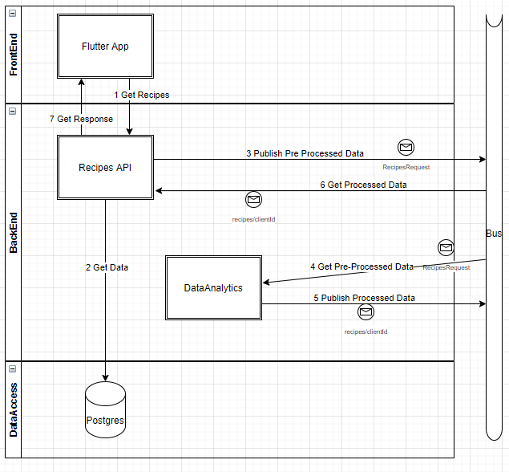

# Chapter 2: Preparation

!!! abstract "Abstract"
    This chapter covers the preparation in terms of the architecture defined for the solution, as well as the setup of the development environment. (**4 min read**)

## Architecture

<!-- Describe the architecture of the solution, including diagrams and proper details to understand the workflows at high level -->

The solution must be integrated with the rest of the application by interacting with the backend through a proper bus. Therefore, this is the general architecture that the service had to meet to allow the integration. 

These are the steps that the application takes in the normal flow:

1. The **App** registers the input of the user and requests recipes to the **Recipes API**.
2. The **Recipes API** gets data from the Database and do the pre-processing of the data to prepare it for the **Data Analytics** service.
3. The **Recipes API** publishes the pre-processed data to the *Events Bus* and waits for the recommended recipes that the **Data Analitycs** will return by subscribing to a configured topic of the bus (e.g. `recipes/{clientId}`).
4. The **Data Analitycs** is subscribed to the configured topic of the *Event Bus* and gets the pre-processed data published by the **Recipes API**.
5. The **Data Analitycs** processes the data to get a set of recommended recipes, and publishes the selected recipes to the *Event Bus* on the same configured topic.
6. The **Recipes API** gets the data with the recommended recipes from the *Events Bus*.
7. The **Recipes API** returns the response to the **App**.

It is important to highlight that if this process from step 4 to 6 takes more than a configured window in seconds, the **Recipes API** will return a default response to the **App** which is just a header of the recipes retrieved in the step 2.

## Setup

<!-- Describe all the needed steps to setup a proper development environment -->

#### Code Repository

At this moment of the project, we didn't have a proper scaffolding nor boilerplate to setup the code repository. Therefore, a new repository was started from scratch, where the following aspects were solved to start the development:

- Repository name following the name convention followed in Matech, so it was named `Matech.Starvapp.RecipesRecomender.Analytics`.
- A Python package to develop the actual logic to process the data
- A folder with the script for the service
- A folder to place the notebooks intended for exploration and checks
- A folder to develop the tests for the solution at *unit* and *system* level
- A folder for development tools (e.g. run linter, set environment, run tests)
- README.md file with relevant information
- Environment management through [virtualenv](https://virtualenv.pypa.io/en/latest/)
- Testing handled with [pytest](https://docs.pytest.org/)

The repository was published [here](https://github.com/Matech-Studios/Matech.Starvapp.RecipesRecomender.Analytics). You can check how the initial structure was defined in [the Pull Request #1](https://github.com/Matech-Studios/Matech.Starvapp.RecipesRecomender.Analytics/pull/1), obtaining this:

      ├── README.md              <- The top-level README for developers using this project
      │      
      ├── starvapprecom          <- Core package of this project.
      │   ├── approaches         <- Module to develop approaches for recipes recommendations                           
      │   ├── scrapers           <- Module to handle scrapers of recipes      
      │   └── utils              <- Module to provide utils in general       
      │                
      ├── data                   <- Folder for datasets to be used locally  
      │
      ├── docs                   <- Project documentation and resources  
      │
      ├── notebooks              <- Place to store all Jupyter notebooks  
      │
      ├── scripts                <- Scripts to execute services and other functions  
      │                
      ├── tests                  <- Unit and System tests of the core library  
      │
      ├── tools                  <- Tools for the development of this project  
      │
      └─── requirements.txt      <- File that specifies the dependencies for this project

#### Environment

All the services in StarvApp are deployed through [Kubernetes](https://kubernetes.io/es/docs/concepts/overview/what-is-kubernetes/), so each of them must provide a `Dockerfile` that allows the DevOps team to achieve the actual deployment. Therefore, for this repository we provided:

- A `Dockerfile` that creates and serves the recommender solution
- A `Dockerfile_rabbitmq` that creates a RabbitMQ server for testing purposes
- A `docker-compose.yml` to configure the connection between these two previous services, for testing purposes.

In addition, to allow an easy way to make local development, there are tools to create and use a [virtualenv](https://pypi.org/project/virtualenv/) which is easier to handle for local tests.

Given that, the development evolved from the explained "boilerplate" to then create the [PR #2](https://github.com/Matech-Studios/Matech.Starvapp.RecipesRecomender.Analytics/pull/2), where the following aspects were solved:

- File `Dockerfile` to build and serve the application
- File `docker-compose.yml` to test quickly a deployment before delivering the application
- Service developed to connect to a [RabbitMQ](https://www.rabbitmq.com/) queue and serve recipes recommendations

After that, the development proceed to enhance and fix some aspects, but in the [PR #7](https://github.com/Matech-Studios/Matech.Starvapp.RecipesRecomender.Analytics/pull/7) the repository evolved to have these aspects done:

- Github Actions to keep an internal Continuous Integration
- Azure Pipelines connection to serve this repo in the flow of Continuous Integration of the entire StarvApp
- Testing to ensure code coverage during the CI workflows

You can check these configurations in the actual code repository.

